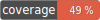

# phpunit-coverage-badge

 

This action calculates the test coverage using a PHPUnit report and generates an SVG badge from it. Supported report types right now are clover and html. Using the html report is only tested with the html file generated by PHPUnit 9.5.0 and might not work in old or future releases if the layout of the report changes. Therefore it is recommended to use the clover report.

The generated badge can also be pushed to the repository to be displayed in the README (or wherever else you might need it).
An example is the badge above this text block, which shows the current test coverage of this project.

Inspired by [cicirello/jacoco-badge-generator](https://github.com/cicirello/jacoco-badge-generator) and [richardregeer/phpunit-coverage-check](https://github.com/richardregeer/phpunit-coverage-check).

The template for the svg badge was created using [Method Draw](http://github.com/duopixel/Method-Draw). The color scheme for the background of the coverage percentage number has been adapted from [cicirello/jacoco-badge-generator](https://github.com/cicirello/jacoco-badge-generator).

# Configuration
This action has no required inputs. It defaults to using a clover report saved in the root directory (clover.xml). 

For the action to be able to parse the clover report and push it to the repository, you need to run the [checkout action](https://github.com/actions/checkout) before running this action.
Basic configuration for the checkout action works like this:
```
      - name: Checkout code
        uses: actions/checkout@v2
```
IMPORTANT: v1.0.0 currently has NO support for a custom checkout path.

You can automatically generate a clover report file with every PHPUnit run by adding the following configuration to your phpunit.xml file:
```
    <coverage cacheDirectory=".phpunit.cache/code-coverage" processUncoveredFiles="true">
        <include>
            <directory suffix=".php">src</directory>
        </include>
        <report>
            <clover outputFile="clover.xml" />
        </report>
    </coverage>
```

The default configuration does **NOT** push the badge back into the repository. 
Setting the input **push_badge** in your workflow to true will enable the commit and push process and the badge will be pushed into the repository after it's been generated. In addition, pushing the badge requires you to update your project settings under `Code and automation` > `Actions` > `General` > `Workflow permissions` to `Read and write permissions`.

Please note: The parsed report file will also be committed and pushed if it changes during the workflow.

If you do not enable **push_badge** you'll need extra steps in your workflow to commit and push the file into the repository.
Please have a look at the inputs for all configuration options.

# Troubleshooting

## Commit by action triggers another action run
As reported by [MikeDevresse](https://github.com/MikeDevresse) in [this issue](https://github.com/timkrase/phpunit-coverage-badge/issues/7), it might be possible that the commit by the Github action triggers a subsequent action run. Adding a specific tag to the actions github action and then checking for the existance of this tag can be used as a workaround (example is a slightly modified version of the one given by MikeDevresse in the issue):
```
jobs:
  build:
    runs-on: ubuntu-latest
    if: "!contains(github.event.head_commit.message, '[ci]')"
```

# Inputs

Paths are always relative to the root of your repository.

## Badge generation
### `report`
The path to the report file generated by PHPUnit. Currently supported are clover and html report files. For html please specify the path to the "index.html"

**default: clover.xml**

### `report_type`
The report type to parse. Can be either 'clover' or 'html'.

**default: clover**

### `coverage_badge_path`
The path inside the repository where the created badge should be saved. Can be anywhere except inside the .github folder.

**default: badge.svg**

## Badge commit and push

### `push_badge`
Defines whether the badge will be committed and pushed to the repository.

**default: false**

Please note: If you enable push_badge you **MUST** add the repo_token, otherwise an exception will be thrown.

### `repo_token`
Token to push the badge into the repository. Just add "${{ secrets.GITHUB_TOKEN }}" as the input.

**default: NOT_SUPPLIED**

### `commit_message`
Commit message that will be used to commit the updated badge and clover file.

**default: Update code coverage badge**

### `commit_email`
Email that will be used for the commit.

**default: 41898282+github-actions[bot]@users.noreply.github.com**

This will display all commits as added by the official github actions account/page.

### `commit_name`
Name that will be used for the commit.

**default: Github Actions Bot**

